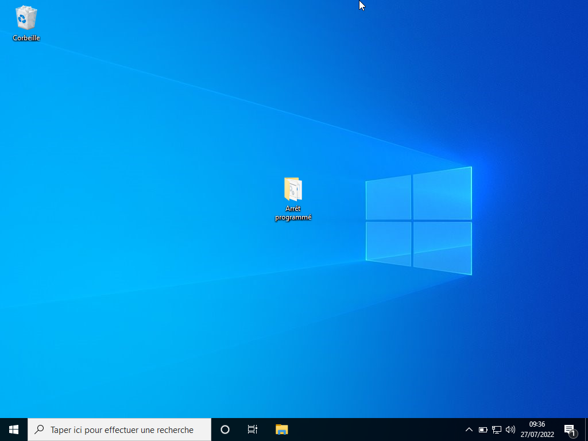
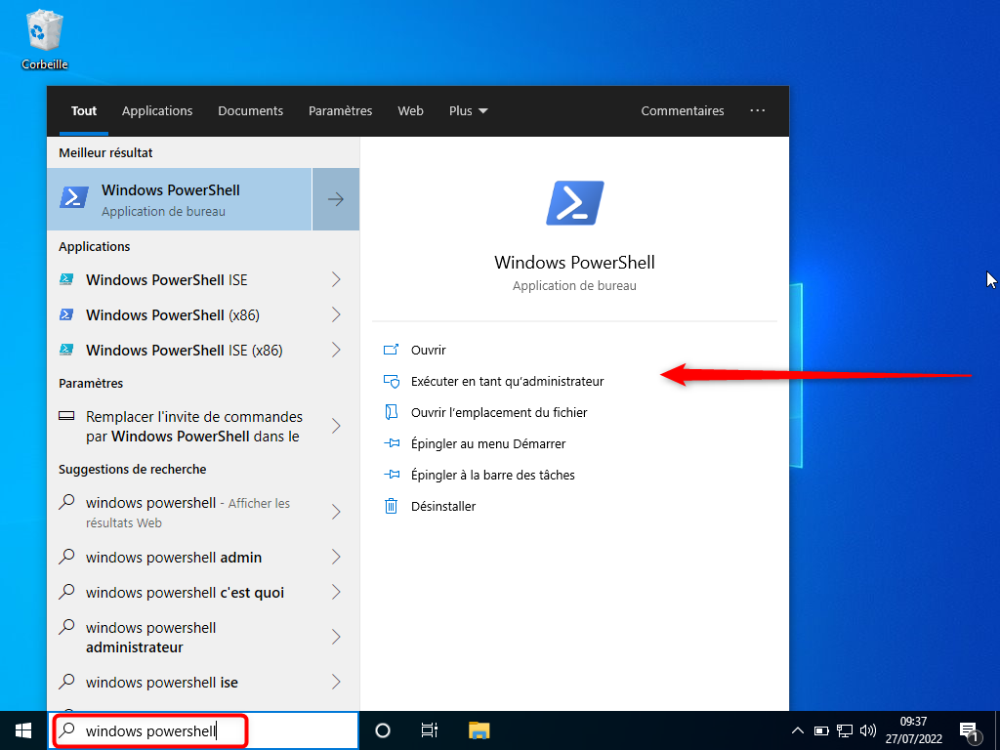
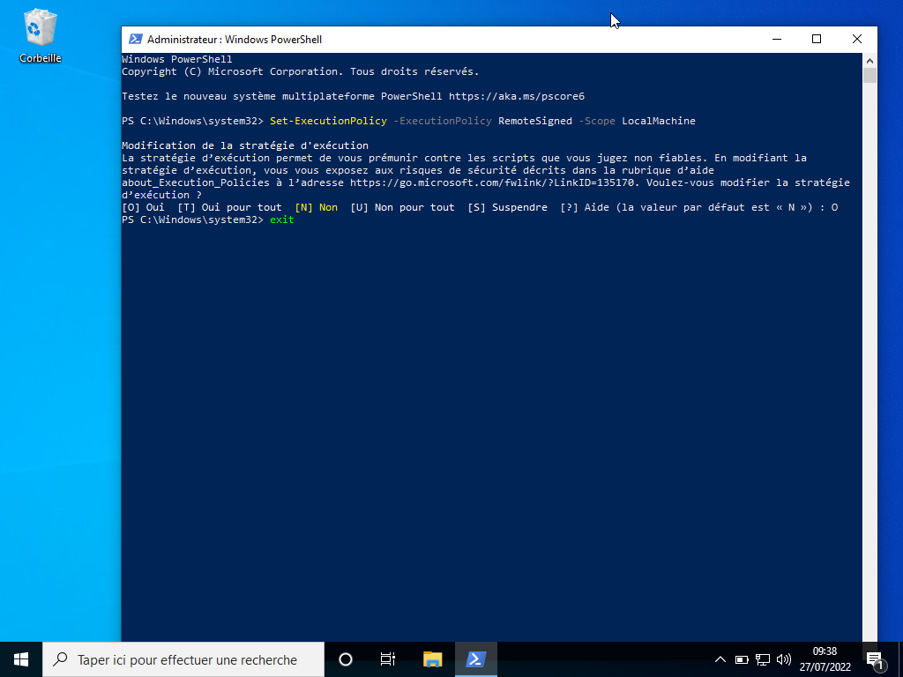
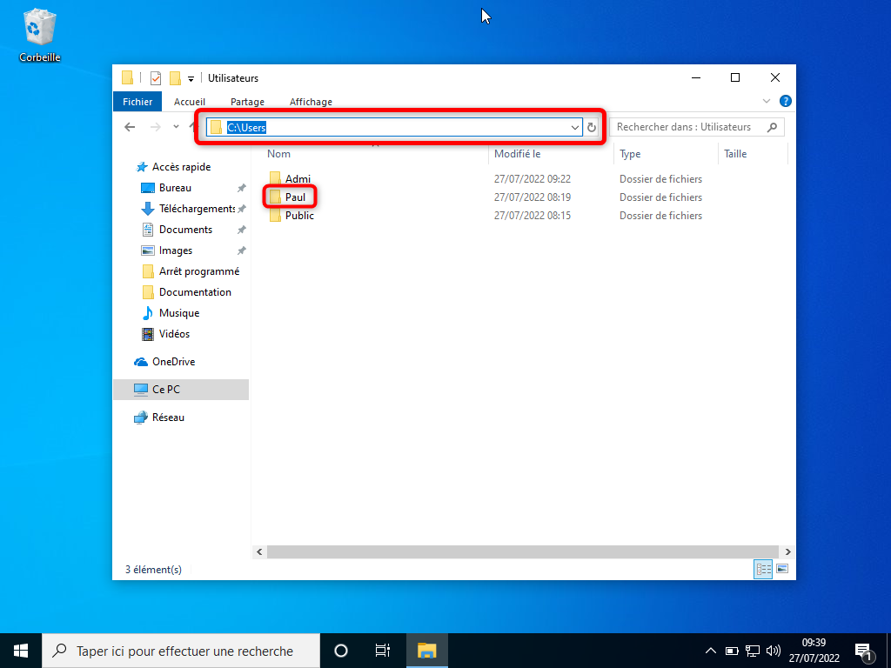
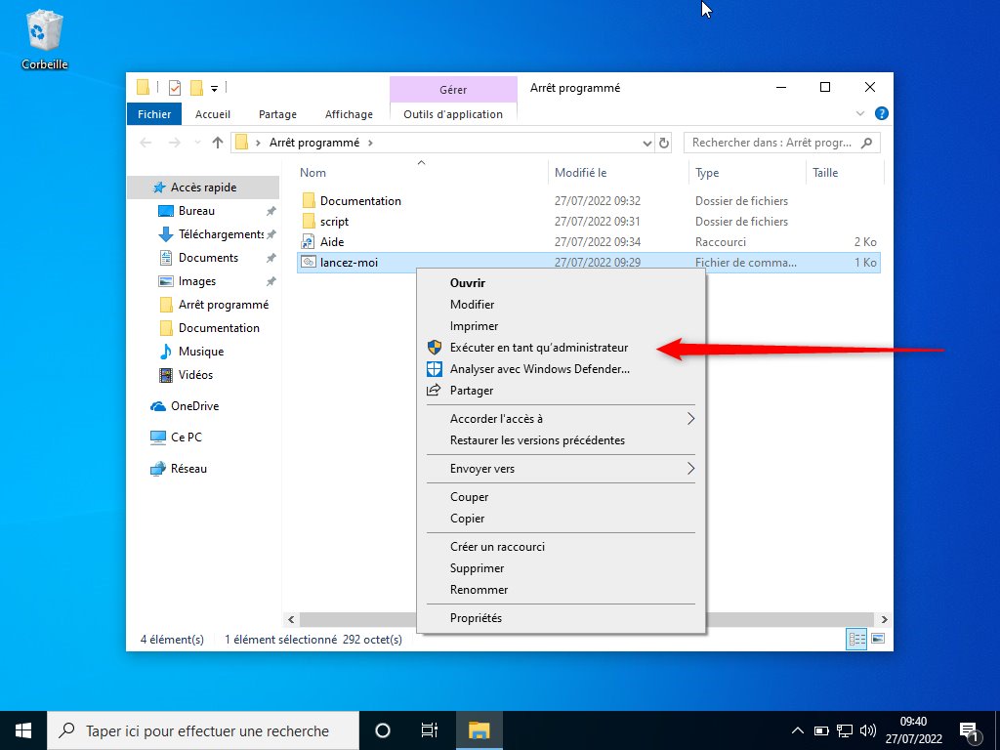

# Poweroff Scheduler

## Aim

### Purpose

This script aims to help regulate screentime by shutting down the computer at a target time.
It was created due to the lack of reliaility of Microsoft Parental Control one can simply exit. 

### How it works

The script prompts for a username and a target time.
When the target user is connected, the script shuts down the computer when the target time os reached. As it is possible to abort a shutdown if there are unsaved files, the script uses a hard shutdown. 
The script also automatically shuts down the computer before 6am if the target user is connected. 
 
## Objectif

L'objectif de ce script est d'éteindre l'ordinateur à une heure voulue quand un utilisateur particulier est connecté.<br>
Le script ne dévoile pas son existence visuellement.<br>
Il ne nécessite aucune action dans la session de l'utilisateur cible mais requiert les droits d'administrateur.
 
> **Warning**
> - Le script a été pensé pour une facilité d'utilisation maximale.<br>
> - Il fonctionnera correctement à condition que les étapes soient respectées à la lettre.
> - Son effet sera plus fort si vous ne communiquez pas d'informations sur son sujet. Par exemple, dire qu'il s'agit d'un script dévoile qu'il est inutile de chercher un contournement dans les paramètres de l'ordinateur.
 
## Installation

### Copie du script
 
 - Ouvrir une session administrateur sur le PC cible.
 - Copier le dossier "Arrêt programmé" à un endroit facilement accessible, de préférence le bureau.
 

 
### Autorisation
 
 - Rechercher `Windows PowerShell` dans la barre Windows.
 - Sélectionner "Exécuter en tant qu'administrateur".
 

 
 - Une fois la console obtenue, entrer la commande suivante et taper ++enter++:
 
```powershell
Set-ExecutionPolicy -ExecutionPolicy RemoteSigned -Scope LocalMachine
```
 
 - Ecrire `O` et taper ++enter++.
 - Ecrire `exit` et taper ++enter++.
 

 
## Utilisation
 
### Informations requises
 
Avant de lancer le script, vous devez vous munir des deux informations demandées.
 
#### Nom du dossier de l'utilisateur cible
 
Le script installe un virus dans le dossier de l'utilisateur cible.
Puisqu'il est possible de changer le nom de ce dossier, le script le redemande.
 
> **Note**
> **Si vous ne connaissez pas le nom du dossier**<br>
> - Dans l'explorateur de fichiers, allez au dossier "C:\Users" (vous pouvez copier-coller le chemin dans la barre de gauche)
> - Retenez le nom **exact** du dossier de l'utilisateur cible.
 

 
#### Heure souhaitée
 
L'heure d'extinction souhaitée devra être communiquée au format hhmm.
Par exemple, pour choisir 22h37 il faut entrer `2237`.
 
### Lancement du script
 
 - Ouvrir le dossier "Arrêt programmé"
 - Faire un click-droit sur "Lancez-moi.dat"
 - Sélectionner "Exécuter en tant qu'administrateur".



> **Note**
> **En cas de bloquage antivirus**<br>
> Puisqu'il s'agit d'un virus, il est possible que votre antivirus bloque l'exécution et affiche une fenêtre avec un message.
> Il y a habituellement la possibilité d'autoriser l'exécution, parfois cachée dans "plus de détails". 

 - Suivez les instructions en tapant ++enter++ à la fin de votre réponse.

> **Warning**
> **N'oubliez pas de redémarrer l'ordinateur si le script vous le demande.**
 
### Pérennité du script
 
En fonctionnement normal, le script arrête l'ordinateur tous les jours à l'heure définie sans qu'aucune action ne soit requise.
 
Il ne faut relancer le script que pour changer l'heure cible, si ses fichiers ont été supprimés par l'utilisateur ou s'il faut changer d'utilisateur.
 
## Contact
 
N'hésitez surtout pas à me contacter en cas de doute. Vous pouvez utiliser le bouton en bas à droite de cette page pour m'envoyer un mail rapidement.
